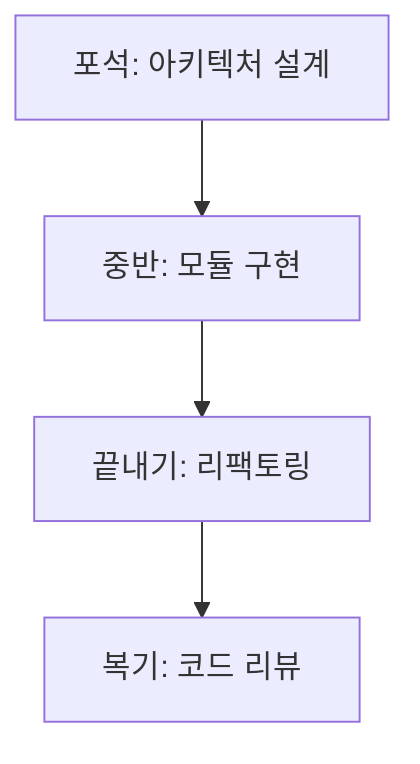

<div align="center">

# Baduck Coding Workbench

### *바둑처럼 두면 세계 최고의 앱이 만들어진다*

**AI 코딩 워크벤치 — 전략적 소프트웨어 개발 플랫폼**

[](https://www.typescriptlang.org)
[](https://react.dev)
[](LICENSE)

> **"코딩을 바둑처럼 — 한 수 한 수가 전체 구조를 결정한다"**
> 소프트웨어 아키텍처를 전략적으로 설계하는 AI 워크벤치

</div>

---

## 🧠 Philosophy

| 기준 | 일반 IDE | Baduck Coding |
|------|---------|---------------|
| 접근 | 코드 먼저 | **전략(아키텍처) 먼저** |
| 설계 | 자유 형식 | **바둑 포석처럼 체계적** |
| AI | 자동완성 | **구조적 조언** |



## 🎯 Getting Started

```bash
git clone https://github.com/Reasonofmoon/baduck-coding.git
cd baduck-coding && npm install && npm run dev
```

## 📄 License

MIT License

<div align="center"><br>

**Baduck Coding** · 코딩을 바둑처럼

Made by [Reason of Moon](https://github.com/Reasonofmoon)

</div>
